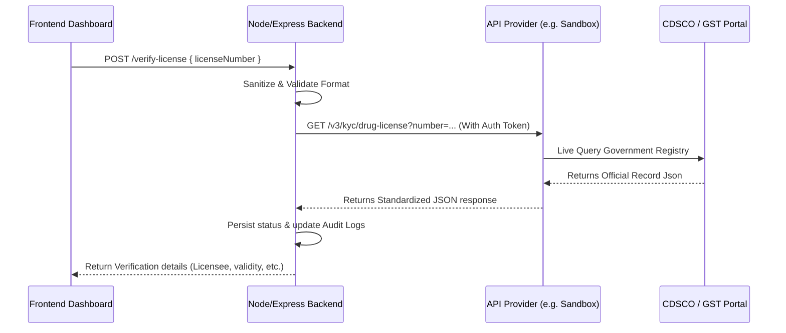

# Real-World Verification Integration Guide

Because government databases (CDSCO and GST Portal) do not provide open, public APIs to standard SaaS applications, real-world systems route validation through specialized compliance API aggregators.

---

## 1. Third-Party Verification Providers

The most reliable API providers in the Indian market for business KYC, GSTIN, and Drug License checking are:

| Provider | Website | Supported APIs |
| :--- | :--- | :--- |
| **Sandbox** | [sandbox.co.in](https://sandbox.co.in) | Drug License (CDSCO/State), GSTIN, PAN, Aadhaar |
| **Cashfree KYC** | [cashfree.com](https://www.cashfree.com/verification-suite/) | GSTIN, PAN, Business Verification |
| **Zoop.one** | [zoop.one](https://zoop.one) | GSTIN, Drug License Search, MCA |
| **Signzy** | [signzy.com](https://signzy.com) | Commercial/Individual KYC APIs |

---

## 2. API Integration Architecture

Below is the verification flow between your application, your backend, the API Aggregator, and the Govt Nodes:



---

## 3. Implementation Code Example (using Sandbox.co.in API)

To switch the local validator to use a real API, update `backend/utils/indianValidators.js` (or your routes file) to execute an outbound HTTP request using standard `fetch` (native in Node.js 18+) or `axios`.

### Node.js Backend Integration Template:

```javascript
// backend/utils/realValidators.js
const dotenv = require('dotenv');
dotenv.config();

const SANDBOX_URL = "https://api.sandbox.co.in";
const CLIENT_ID = process.env.SANDBOX_CLIENT_ID;
const CLIENT_SECRET = process.env.SANDBOX_CLIENT_SECRET;

/**
 * Gets an authentication token from the Sandbox.co.in provider
 */
async function getSandboxToken() {
  const res = await fetch(`${SANDBOX_URL}/authenticate`, {
    method: 'POST',
    headers: {
      'Accept': 'application/json',
      'Content-Type': 'application/json',
      'x-api-key': CLIENT_SECRET,
      'x-api-version': '1.0'
    },
    body: JSON.stringify({
      client_id: CLIENT_ID,
      client_secret: CLIENT_SECRET
    })
  });

  if (!res.ok) {
    throw new Error('Authentication with KYC provider failed.');
  }
  const data = await res.json();
  return data.access_token; // JWT Token to use for subsequent requests
}

/**
 * Real-world Drug License verification querying the official state/central registry
 */
async function verifyDrugLicenseReal(licenseNumber) {
  try {
    const token = await getSandboxToken();
    const res = await fetch(`${SANDBOX_URL}/kyc/drug-license?number=${encodeURIComponent(licenseNumber)}`, {
      method: 'GET',
      headers: {
        'Authorization': token,
        'x-api-key': CLIENT_SECRET,
        'x-api-version': '1.0'
      }
    });

    const data = await res.json();

    if (!res.ok) {
      return {
        success: false,
        error: data.message || "Failed to retrieve drug license record."
      };
    }

    // Map provider-specific response to our application structure
    return {
      success: true,
      data: {
        verifiedAt: new Date().toISOString(),
        licenseeName: data.result.firm_name || data.result.proprietor_name,
        validUntil: data.result.expiry_date,
        issuingAuthority: data.result.issuing_authority || "State Drugs Control Department",
        regNo: data.result.license_number,
        drugCategories: data.result.categories?.join(', ') || "Authorized Drug Categories",
        verificationHash: `REAL-CDSCO-${data.transaction_id}`
      }
    };
  } catch (err) {
    console.error("KYC Service Error:", err);
    return {
      success: false,
      error: "Verification service temporarily unavailable."
    };
  }
}

module.exports = {
  verifyDrugLicenseReal
};
```

### Route Handler Update (`superAdminRoutes.js`)

Change the endpoint in your routes to handle the asynchronous external API call:

```javascript
// e:\New folder\medicore\backend\routes\superAdminRoutes.js

const { verifyDrugLicenseReal } = require('../utils/realValidators');

router.post('/verify-license', async (req, res) => {
  try {
    const { licenseNumber } = req.body;
    
    // Call the real API integration helper
    const result = await verifyDrugLicenseReal(licenseNumber);
    
    if (result.success) {
      // Write to audit trail
      await writeAudit(req, 'LICENSE_VERIFICATION_SUCCESS', `Verified license ${licenseNumber}`);
      res.json(result.data);
    } else {
      await writeAudit(req, 'LICENSE_VERIFICATION_FAILED', `Failed verification for ${licenseNumber}: ${result.error}`);
      res.status(400).json({ error: result.error });
    }
  } catch (err) {
    res.status(500).json({ error: err.message });
  }
});
```
